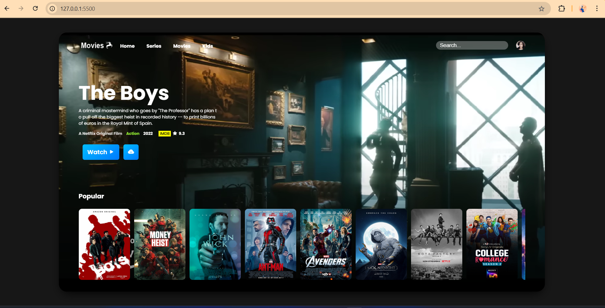
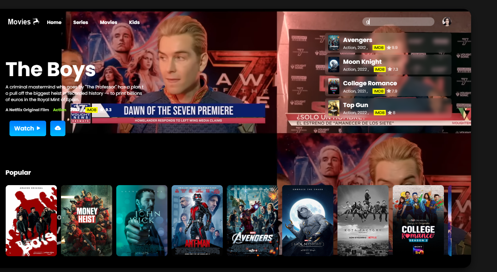

# Movies_Website_using_HTML_CSS_JavaScript

A static and visually appealing movie website built using **HTML5**, **CSS3**, and **JavaScript**. This project demonstrates the use of modern web development techniques including DOM manipulation, dynamic content rendering, and basic animation. It's ideal for beginners looking to explore front-end development and build a stylish UI from scratch.

---

## 🚀 Features

- Interactive and responsive movie website UI
- Hero video banner for immersive experience
- Dynamic movie cards generated using `movie.json`
- Search functionality with JavaScript
- Organized structure using external assets (images/videos)
- Fully responsive design for mobile and desktop

---

## 📁 Project Structure

- `index.html` – Main HTML page layout
- `style.css` – CSS styles for layout, design, and responsiveness
- `app.js` – JavaScript logic for loading movies dynamically
- `movie.json` – Contains movie data in JSON format
- `/img` – Folder containing movie poster images
- `/video` – Folder for background or trailer videos

---

## 🛠️ Tools Used

- HTML5
- CSS3 (Flexbox, Grid)
- JavaScript (ES6)
- Visual Studio Code

---

## 📽️ Demo Video

[🎬 Click here to watch the demo video](./video/demoRec.mp4)

---

## 📸 Screenshots

### 🏠 Homepage (Initial Load)

### 🎞️ Movie Section

